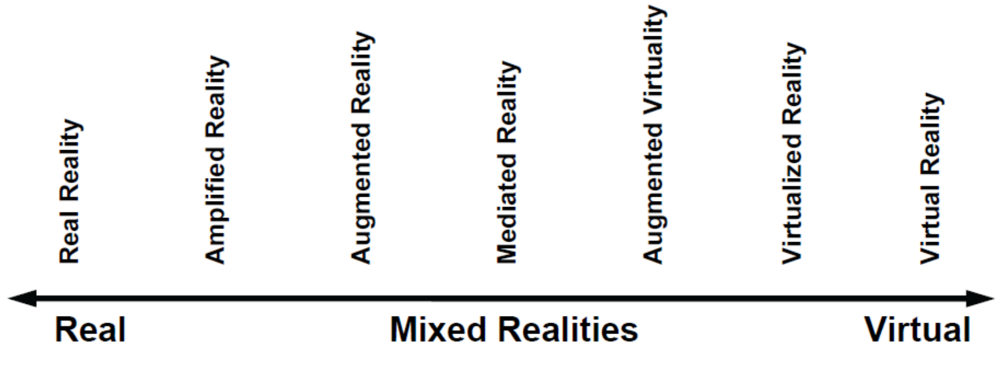

# Augmented Reality

## Introduction

- Definition
  - Various Mixed Reality
  
    - depending on the percentage of reality \& virtuality in the total provided information
  
     
  
  - AR/MR System
    
    - combines real \& virtual objects in a real environment
    - is interactive in real-time
    - registers \& aligns real and virtual objects with each other
  
- Goal

  - New Interaction Approach
    - directly visualize virtual object, e.g. big data $\Rightarrow$ better understanding \& interpretation
    - easier to interact with virtual object
    - provide more information in a human-friendly way

## Infrastructure

- Compute Platform
  - Fixed Workstation
    - large, NOT portal device, usually used in VR
  - Backpack Notebook
    - used in early AR 
  - Mobile Phone
    - currently, most widely used mobile AR platform
    - pros: pervasive platform, multiple integrated sensors
    - cons: need to hold by hand $\Rightarrow$ increase interaction difficulty
  - AR Glasses
    - hands-free experience, dedicated AR device
- Display Platform
  - Optical See-through Display
    - mostly in the form of glasses
  - Video See-through Display
    - camera + screen, e.g. mobile phone
  - Surface Projection
    - raw-eye 3D visualization
    - display directly on physical object (e.g. projecting onto table)
- Network Accessibility
  - WWAN
    - e.g. 2/3/4/5G network
  - WLAN
    - e.g. wifi
  - WPAN
    - interconnect devices, e.g. blue-tooth

## User Interface & User Experience

- Guideline
  - General Concern
    - fun and usable
    - quick and responsive
  - AR-Specific Concern
    - enable task-relevant interaction $\Rightarrow$ usefulness
    - provide user-based context $\Rightarrow$ personalization \& privacy
    - correct \& enough feedback (AR expects more feedback as it is based on reality)
    - combines the AR-content with the real physical elements $\Rightarrow$ more realistic experience
    - capability for collaboration
    - $\Rightarrow$ immersion user experience

## Object Tracking & Registration

- Goal

  - Tracking

    - track the location of target (actually localization)

  - Registration

    - align the virtual content with physical real world given current pose info

  - Joint Goal

    - determine which \& how the virtual content should be displayed for a user

      (considering its location, pose \& view point)

- Tracking (Localization)

  - Location Sensor Based

    - GPS + IMU + Kalman filter

  - Magnetic Based

    - use earth magnetic field to obtain orientation 
    - cons: may get interfered with ambient electromagnetic fields (e.g. city environment)

  - Electromagnetic Based

    - use time-of-arrive of signal to measure distance \& translate into location

      (e.g. wifi for localization)

    - cons: multi-path problem, etc...

  - Marker Based

    - object detection to detect \& recognize marker $\Rightarrow$ obtain pre-calculated location
    - cons: useful only in in-door environment
    - pros: may get used for user active localization (e.g. a task in AR game)

  - Visual Perception Based

    - frame-by-frame tracking each user by monitors 

      (detection, 3D re-projection with the help of HD map, smoothing)

    - SLAM based techniques

  - 

## Data Management

- Data Model
  - Database-Interface-Application
  - Client-Federation-Server
    - federal layer in the mid to handle incorrect/missing data
- Database
  - Distributed Database...

## System Performance

- Performance Bottleneck
  - End Device Support
    - limited cpu \& gpu support $\Rightarrow$ limited computability
    - limited cache \& bandwith $\Rightarrow$ slow data fetching \& expensive cache miss
    - low clock-rate \& power supply $\Rightarrow$ efficiency - sustainability trade-off
  - Compute Intensive Operation
    - tracking \& registration
    - graphics rendering
- Algorithm Speedup
  - Approximate Computation
    - approximate rendering $\Rightarrow$ allow sub-optimal result for less intensive compute
    - need to analyze the resilience (tolerance to imprecise result) of each AR application
- Compute Out-sourcing
  - Server Computing
    - stream video to server \& end-device perform little task
    - end-device only as display (of a video stream)
    - end-device receive tracking + registration result \& perform rendering (less network demanded)
    - cons: depends on network accessibility (video stream could be network-hungry)
  - Edge Computing
    - use other local device to assist computation task (e.g. AR glasses use phone as an edge server)

## Current Challenges

- Efficiency

  - Energy Efficiency

    - require long-time operation of compute-intensive tasks

      (e.g. network connection, camera capturing, GPS receiving, ...)

  - Development Efficiency

    - lack of common foundation library

      (most AR app tends to re-implement basic function)

      $\Rightarrow$ hard to maintain \& less efficient (regarding both development and running)

- Security \& Privacy

  - Private Data
    - current location, personal view point, ...
    - data is transmitted in network \& can be handed to third-party server for processing

- Dependency

  - Tech Dependency

    - depends on the advance of too many other areas, e.g.

      edge computing (IoT), network, energy (battery), computer vision, wearable device, ...

## Application Examples

