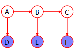

### Graphical Models

- Diagrammatic representations of probability distributions:
  - A simple way to visualize the structure of a probabilistic model and can be used to design and motivate new models
  - Insights into the properties of the model (e.g. conditional independence) can be obtained by inspection of the graph.
  - Graphical manipulations to expresse complex computations

#### Bayesian Networks

1. Structure:

   - Joint Distribution $\rightarrow$ Graph: 

     - A **node** for each random variable in the distribution
     - An **directed edge** from a random variable $a$ to all other random variables conditioned on $a$ 

   - Graph $\rightarrow$ Joint Distribution: 

     - $\displaystyle p(\mathbf x) = \prod_{k=1}^Kp(x_k|pa(x_k)) \text{, where $pa(x)$ = parents of $x$ }$ 

       ​	A **product** of distributions, one for each associated random variable $\text{(over all the nodes)}$ 	

       ​	For each node, add all **parents** to its conditioning variables list $\text{(conditioned on parents)}$ 

     - Must be **directed acyclic graph** 

     - Normalization proof:

       ​	$\text{Start with the node with no outgoing edges, denoted as $x_i$}$ 

       ​	$\begin{aligned} \displaystyle \sum_{\mathbf x}p(\mathbf x) &= \sum_{x_1,...,x_K} \prod_{k=1}^Kp(x_k|pa(x_k) \\ &= \sum_{x_1,...,x_{i-1},x_{i+1}...,x_K}\left(\sum_{x_i} \prod_{k=1}^Kp(x_k|pa(x_k)\right) \\ &=  \sum_{x_1,...,x_{i-1},x_{i+1}...,x_K} \left( \prod_{k=1 \land k\neq i}^Kp(x_k|pa(x_k)) \underbrace{ \sum_{x_i} p(x_i|pa(x_i))}_{=1} \right) \end{aligned}$ 

       ​	$\text{Repeat until no node left}$ 

   - Example:

     - Distribution: $p(x_1)p(x_2)p(x_3)p(x_4|x_1,x_2,x_3)p(x_5|x_1,x_3)p(x_6|x_4)p(x_7|x_4,x_5)$ 

     - Graph:   

       $\Rightarrow \text{A fully connected graph for general distribution }p(x_1,...,x_K)=p(x_K|x_1,...,x_{K-1})\cdots p(x_2|x_1)p(x_1) $ $ \small \text{( if reduced to undirected graph)}$ 

       $\Rightarrow \text{Absence of edges carries important indormation}$ 

   - Extension:

     - A node can be vectors or sets of variables 

2. Notation:

   - Plate Notation: 
     - $\displaystyle p(\mathbf t,\mathbf w)=p(\mathbf w)\prod_{n=1}^Np(t_n|\mathbf w):$   $\boldsymbol\Leftrightarrow$   
   - Parameters of model:
     - Observed random variables 	= shaded circles 
     - Unobserved random variables  = open circles
     - Deterministic variable                 = smaller solid circles 
     - $\displaystyle p(\mathbf t,\mathbf w|\mathbf X, \alpha, \sigma^2)=p(\mathbf w|\alpha) \prod_{n=1}^Np(t_n|\mathbf w,x_n,\sigma^2): $    
   - Prediction:
     - $p(\hat t\mid \hat x,\mathbf x.\mathbf t,\alpha,\sigma^2) \propto \int p(\hat t,\mathbf t,\mathbf w\mid \hat x,\mathbf x,\alpha,\sigma^2)d\mathbf w$ 
     - $\normalsize p(\hat t,\mathbf t,\mathbf w|\hat x, \mathbf X, \alpha, \sigma^2) = \left[ \prod_{n=1}^Np(t_n|x_n,\mathbf w,\sigma^2) \right] p(\mathbf w|\alpha)p(\hat t |\hat x,\mathbf w, \sigma^2): \\ \small \text{(assume  $y = y(x,\theta)+\epsilon$; $\hat x$ is new data; $\hat t$ is prediction)}$   

3. Conditional Independence:

   - Definition:
     - $p(a,b|c)=p(a|c)p(b|c) \Leftrightarrow$ $a \text{ is conditionally independent of $b$ given $c$}$ 
     - $\text{same as } p(a|b,c)=p(a|c)$ 
   - Notation: $a \perp\!\!\!\perp b \mid c$ 
   - Conditional Independence $vs.$ Independence:
     - $\text{Neither of them implies the other}$ 
     - $p(a,b|c)=p(a|c)p(b|c) \text{ reduces to independence when } c=\varnothing \space \small (a\perp\!\!\!\perp b \mid \varnothing \Leftrightarrow \text{$a,b$ independent }) $ 

4. Conditional Independence on graph:

   - The presence of $\text{TT-node}$: $\small p(a,b,c)=p(a|c)p(b|c)p(c)$ 
     - $a\not\!\perp\!\!\!\perp b \mid \varnothing :$   $\displaystyle  p(a,b)=\sum_c p(a|c)p(b|c)p(c) \neq p(a)p(b)$ 
     - $a \perp\!\!\!\perp b \mid c :$  $\displaystyle  p(a,b|c) = \frac {p(a,b,c)}{p(c)} = p(a|c)p(b|c)$  
     - Conditioning on $c \text{ blocks }$ the path from $a$ to $b \Rightarrow$ $a,b$ conditionally independent on $c$  
   - The presence of $\text{HT-node}$: $\small p(a,b,c)=p(a)p(b|c)p(c|a)$ 
     - $a \not\!\perp\!\!\!\perp b \mid \varnothing:$   $\displaystyle p(a,b)=\sum_cp(a)p(b|c)p(c|a) \neq p(a)p(b)$ 
     - $a \perp\!\!\!\perp b\mid c:$  $\displaystyle p(a,b|c)=\frac {p(a)p(b|c)p(c|a)}{p(c)} = p(a|c)p(b|c)$ 
     - Conditioning on $c \text{ blocks }$ the path from $a$ to $b \Rightarrow$ $a,b$ conditionally independent on $c$ 
   - The absence of $\text{HH-node}$: $\small\text{p(a,b,c)=p(a)p(b)p(c|a,b)}$ 
     - $a \perp\!\!\!\perp b \mid \varnothing:$   $\displaystyle p(a,b)=\sum_cp(a)p(b)p(c|a,b)=p(a)p(b)$ 
     - $a \not\!\perp\!\!\!\perp b \mid c:$   $\displaystyle p(a,b|c)=\frac{p(a)p(b)p(c|a,b)}{p(c)}\neq p(a|c)p(b|c)$ 
     - Conditioning on $c$ $\text{unblocks}$ the path $\Rightarrow a,b$ dependent $\text{(absence of HH-node blocks the path)}$ 
     - Extension: $\boldsymbol\exists x\text{ is descendant of HH-node} \Rightarrow \text{conditioning on $x$ unblocks the path}$ 

5. Blocked Path Definition:

   - A path which contains

     - an observed $\text{TT-node}$ or $\text{HT-node}$, or

     - an unobserved $\text{HH-node}$ whose $\text{descendants}$ are **all** unobserved

       $\text{(need to condition on any observed node in the path when considering blocked/unblocked)}$ 

6. D-Separation

   - Definition:

     - $A,B,C$ are non-intersecting sets of nodes in a Bayesian network

     - If all possible paths are blocked by nodes in $C$, then $A$ is D-separated from $B$ by $C$ 

     - $\Rightarrow$ Joint distribution of the graph satisfies $A\perp\!\!\!\perp B\mid C$ 

       $\small \text{ (conditioning on observed nodes in $C$; All nodes outside $C$ considered unobserved)}$ 

       (Note: D-separation stands for 'directional' separation)

   - Example:

     - Graph:  

     - path $a\rightarrow b$ in (a) not blocked by either $e$ or $f$ 

       path $a\rightarrow b$ in (b) is blocked by $e$ and $f$ 

   - Conditional Independence $\Leftrightarrow$ Factorisation:

     - Factorisation $\Rightarrow$ Conditional Independence:

       If probability distribution factorises according to a directed acyclic graph, and disjoint subsets of nodes $A, B, C$ satisfy that $A$ is D-separated from $B$ by $C\Rightarrow$ Distribution satisfies $A\not\!\perp\!\!\!\perp B\mid C$ 

     - Conditional Independence $\Rightarrow$ Factorisation:

       If probability distribution satisfies conditional independence statements implied by 			D-separation over a directed graph $\Rightarrow$ it can factorise according to the graph

7. Understanding:

   - Conditional Independence $\Rightarrow$ Factorisation:

     - provides factorised computational model $p(x)$ from Conditional Independence statements given by domain experts

   - All Conditional Independence statements can be shown as D-separation in a DAG

     - But there are sets of statements **cannot** be satisfied by any Bayesian Network

   - Bayesian Network as filter:

     - Only let $p(x)$ satifying factorisation property through

     - Only let $p(x)$ respecting conditional independence $\small\text{(implied by D-separation)}$ through

         

#### Markov Random Fields (MRFs)

- Undirected graphical model
- Different conditional independence statements than Bayesian networks 
  - $\Rightarrow$ **CRFs (Conditional Random Feilds)** 

1. Conditional Independence

   - Graph Separation:
     - In undirected graph $G$, with $A, B, C$ disjoint subsets of nodes, if every path from $A$ to $B$ includes at least one node from $C$, then $C$ is said to separate $A$ from $B$ in $G$ 
   - In undirected graph $G$, with $A, B, C$ disjoint subsets of nodes:
     - $A \perp\!\!\!\perp B \mid C$ iff $C$ separates $A$ from $B$ in $G$ 

2. Probability Distribution:

   - A MRFs is a **set** of probability distributions such that, for each distribution:
     - there exisits an undirected graph $G$ with disjoint subsets of nodes $A,B,C$
     - in which $A \perp\!\!\!\perp B \mid C$ whenever $C$ seperates $A$ from $B$ in $G$ 
   - "MRF is such a graph" means:
     - MRF represents set of the probability distributions
     - whose conditional independence are given by the graph

3. Factorisation in MRFs:

   - $2$ not directly linked nodes conditionally independent on all other nodes

     - $x_i \perp\!\!\!\perp x_j \mid (\mathbf x-\{x_i,x_j\}), \text{ where $x_i,x_j$ not on the same edge}$ 

   - Cliques:

     - complete sub-graph
     - $\Rightarrow$ Maximal clique: a clique that is not a subset of other clique

   - Factorisation with (maximal) cliques:

     - For maixmal clique $C \in \mathcal C$ in undirected graph $G$ ,$\mathbf x_C$ are nodes in $C$ 
     - $\displaystyle \Rightarrow \text{Probability distribution $p(x)$ factorises with respect to $G$ if } p(x)=\frac 1Z \prod_{C\in\mathcal C} \psi_C(\mathbf x_C) \\ \small \text{where $\mathcal C$ is the set of maximal cliques of $G$, potential functions $\psi_C(\mathbf x_C)\ge 0$, $Z = \displaystyle\sum_{\mathbf x}p(\mathbf x)$ for normalization} $ 

   - Conditional Independence $\Leftrightarrow$ Factorisation:

     - Factorisation $\Rightarrow$ Conditional Independence:

       Probability distribution factorises according to undirected graph $G$; $A, B,C$ are disjoint subsets of nodes such that $C$ separates $A$ from $B$ in $G$ 

       $\Rightarrow$ In distribution: $A \perp\!\!\!\perp B \mid C$ 

     - Conditional Independence $\Rightarrow$ Factorisation: $\small \text{(Hammersley-Clifford Theorem)}$ 

       **Strictly positive** probability distribution $\forall x,p(x) > 0$ satisfies conditional independence statements implied by graph separation over a particular undirected graph $G$ 

       $\Rightarrow$ It factorises according to $G$ 

   - Factorisation in **Strictly Positive** Potential Functions:

     - Let potential function $\displaystyle \psi_C(\mathbf x_C) = \boldsymbol{\mathcal e} ^{-E(\mathbf x_C)}, \space E(\mathbf x_C)  \text{ called energy function}$ 
     - $\displaystyle\Rightarrow p(\mathbf x)=\frac 1 Z \prod_{C\in\mathcal C}\psi_C(\mathbf x_C)=\frac 1 Z \mathcal {\boldsymbol e}^{\displaystyle -\sum_{C\in \mathcal C}E(\mathbf x_C)} $ 

4. **Linear-chain CRF**:

   - Graph:
     -  

   - Maximum Cliques:
     - $\{y_i, X\}$: energy function $\displaystyle =\sum_{n=1}^N \alpha_nf_n(y_i, X)$ $\Rightarrow  n$ feature functions for each cliques

     - $\{y_{i-1},y_i\} $: energy function $\displaystyle = \sum_{m=1}^M \beta_m f_m(y_{i-1},y_i)$ $\Rightarrow m$ features functions for each cliques 

       $\Rightarrow$ denoting all energy functions as

       $\displaystyle E(y_{i-1}, y_i, X) =  \sum_{k=1}^K w_k f_k(y_{i-1},y_i,X)$ 

   - Likelihood of $Y \text{ given } X$:

     - $\displaystyle P(Y|X) = \frac 1 Z {\displaystyle \text{exp} \left[\sum_{t=1}^T \sum_{k=1}^K w_k f_k(y_{t-1},y_t,X)\right]}, \text{ where } Z = \sum_Y \text{exp} \left[\sum_{t=1}^T\sum_{k=1}^K w_k f_k(y_{t-1},y_t,X)\right]$ 

     - $\displaystyle \ln P(Y|X)= \sum_{t=1}^T \sum_{k=1}^K w_k f_k(y_{t-1},y_t,X) - \ln Z$ 

       $\begin {align} \Rightarrow \displaystyle\frac{\partial}{\partial w_k} \ln p(Y | X) &= \sum_{t = 1}^T f_k(y_{t-1}, y_i, X) - \frac 1 Z \frac {\partial Z}{\partial w_k} \\ &= \sum_{t = 1}^T f_k(y_{t-1}, y_i, X) -  \frac 1 Z \sum_Y \left( \text{exp} \left[\sum_{t=1}^T\sum_{k=1}^K w_k f_k(y_{t-1},y_t,X) \right] \cdot  \sum_{t = 1}^T f_k(y_{t-1}, y_i, X) \right) \\ &=  \sum_{t = 1}^T f_k(y_{t-1}, y_i, X) - \sum_Y \left( \frac 1 Z {\text{exp} \left[\sum_{t=1}^T\sum_{k=1}^K w_k f_k(y_{t-1},y_t,X) \right]} \cdot  \sum_{t = 1}^T f_k(y_{t-1}, y_i, X) \right) \\ &= \sum_{t = 1}^T f_k(y_{t-1}, y_i, X) - \sum_Y p(Y|X) \cdot \sum_{t = 1}^T f_k(y_{t-1}, y_i, X) \end{align}$ $\Rightarrow 1^{\text{st}}$ part is current value, $2^\text{nd}$ is expected value

       $\Rightarrow$ gradient decent until reaching the expected value

       $\text{Note: can use DP (similar to vertebi) to calculate p(Y|X)}$ 

   - Compared with HMM:

     - No assumption of dependency in the observed sequence; whereas HMM force observed data controled only by current emission distribution
     - a much larger set of features described by feature functions; 
     -  can have arbitrary weights due to the normalization factor $Z$; whereas HMM consists of probability in $[0,1]$ 

5. Example of Image Denoising:

   - Problem & Goal:

     - An unknown noise-free image described by binary pixels $x_i \in \{-1,1\}$ is added with noise
     - Noise: Randomly flip sign of each pixel with small probability and denoted by $y_i\in \{-1,1\}$ 
     - $\Rightarrow$ Recover the noise free image

   - Prior Knowledge from problem:

     - Noise level is small $\Rightarrow$ strong correlation between original $x_i$ and observed $y_i$ 
     - Neighbouring pixels $x_i,x_j$ are strongly correlated

   - MRF Capturing Prior:

     -   	

     - Cliques $\{x_i,y_i\}$:

       Energy function: $E(x_i,y_i)=-\eta x_iy_i, \eta>0 \Rightarrow \text{Potential function: } \psi= \boldsymbol{\mathbf e}^{\eta x_iy_i}$ 

       $\Rightarrow$ Favors equal signs for $x_i,y_i$ 

     - Cliques of neighbouring $\{x_i,x_j\}$: 

       Energy function: $E(x_i,x_j)=-\beta x_ix_j,\beta>0 \Rightarrow \text{Potential function: } \psi=\boldsymbol{\mathcal e}^{\beta x_ix_j}$ 

       $\Rightarrow$ Favors equal signs for $x_i,x_j$ 

     - Fact that one kind of pixels might appears more often

       $\Rightarrow$ adding term $hx_i$ 

       ​	$\text{Reason: Potential function is an arbitrary, non-negative function over maximal cliques}$ 

       ​	$\Rightarrow \text{allowed to multiply it by any nonnegative function of subsets of the clique}$   

   - Joint Distribution:

     - Total Energy Function: $\displaystyle E(\mathbf x,\mathbf y)=h\sum_i x_i-\beta \sum_{i,j}x_ix_j - \eta\sum_i x_iy_i $ 
     - $\displaystyle\Rightarrow p(\mathbf x,\mathbf y) = \frac 1 Z \boldsymbol{\mathbf e}^{-E(\mathbf x,\mathbf y)}$ 

   - Iterated Conditional Mode: $\text{(cannot avoid local minimum)}$

     - Fix $\mathbf y \text{  (observed)} \Rightarrow$ implicitly defines $p(\mathbf x\mid \mathbf y)$ 
     - Initialize $\forall i, x_i:=y_i$ 
     - For each node $x_i,$ evaluate total energy for $x_i=-1,1$ with other nodes fixed ($\forall j\neq i, x_j=y_j$)
     - Set $x_i$ to the lower energy state $(\text{Lower energy} \Rightarrow \text{Larger probability})$ 

6. Comparison with Bayesian Networks:

   - Chain:

     - Bayesian Network:

         

       $p(\mathbf x) = p(x_1)p(x_2|x_1)p(x_3|x_2)\cdots p(x_N|x_{N-1}) $ 

     - MRFs:

         

       $p(\mathbf x) = \frac 1 Z \psi_{1,2}(x_1,x_2)\psi_{2,3}(x_2,x_3)\cdots\psi_{N-1,N}(x_{N-1},x_N) $  

     - Corresponding term:

       ​	$\begin{aligned} \psi_{1,2}(x_1,x_2)=& \space p(x_1)p(x_2|x_1) \\ \psi_{2,3}(x_2,x_3) =& \space p(x_3|x_2) \\ \vdots& \\ \psi_{N-1,N}(x_{N-1},x_N) =&\space p(x_N|x_{N-1}) \end{aligned} \\ Z = 1 \text{ for MRFs}$ 

   - Bayesian Networks in MRFs:

     - Moralisation: For every nodes in Bayesian Networks, fully connect its parents in MRFs

       ​	$\text{(Simulation instead of expressing the same distribution)}$ 

     - Expressing Distribution in Graph:

         

       $P:$ set of probability distribution

       $D:$ set of distribution expressed by $\text{directed graph (Bayesian Networks)}$ 

       $U:$ set of distribution expressed by $\text{undirected graph (Markov Random Fields)}$ 

     - In both: $\text{e.g. chain}$

     - Only in Bayesian Networks: $\text{HH-node}$ 

     - Only in MRFs: $\text{4-nodes clique}$ 

7. Common betweeb two graphs:

   - Conditional independence statements are related to concepts of $\text{separation}$ in the graph.
   - Simplified algebraic structure $\text{(factorisation of p(x))}$ is related to ’local pieces’ of the graph 
     - BNs: child with its parents
     - MRFs: Cliques

#### Factor Graphs

1. Definition:

   - Nodes:
     - Variable nodes: variables $\text{(circle)}$ 
     - Factor nodes: function taking its neighbour as variables $\text{(solid square)}$ 
   - Bipartite Graph over set of $\text{variable nodes}$ and set of $\text{factor nodes}$ 

2. Expressing Distribution:

   - $\displaystyle p(\mathbf x) = \prod_sf_s(\mathbf x_s),\text{ where $\mathbf x_s$ a subset of variables, $f_s(\cdot)$ factor connecting to that subset}$ 

3. Bayesian Networks & MRFs in Factor Graphs:

   - Bayesian Network $\rightarrow$ Factor Graph:

     - Variable node for each node in BNs

     - Factor node for corresponding (conditional) distributions

       ​	$\text{(may be several factor graph for one directed graph)}$ 

   - MRFs $\rightarrow$ Factor Graph:

     - Variable node for each node in MRFs

     - Factor node for corresponding maximal clique

     - Factor $f_S(\mathbf x_S)$ for potential function of maximal clique $\mathbf x_S$ 

       ​	$\text{(may be several factor graph for one undirected graph)}$  

4. **Sum-Product Algorithm**:

   - Goal:

     - Calculate marginal $\displaystyle p(x)=\sum_{\mathbf x - \{x\}}p(\mathbf x)$, in $P\text{ time}$ 

   - Math Underneath:

     - Swap $\sum\prod$ to $\prod\sum$ using independence

       $\begin{align}\displaystyle \text{Ex. } p(\mathbf x) &=\sum_{x_1,x_3,x_4}f_a(x_1,x_2)f_b(x_2,x_3)f_c(x_2,x_4) \\ &=\left( \sum_{x_1}f_a(x_1,x_2)\right) \left( \sum_{x_3}f_b(x_2,x_3) \right)\left( \sum_{x_4}f_c(x_2,x_4) \right) \end{align}$ 

   - Assumption:

     - Tree-structured factor graph $\Rightarrow$ to use independence (expressing solution space of $\text{DP}$)  

   - Messages:

     - Variable nodes $\rightarrow$ Factor node:

       $\text{Leaves: }\displaystyle \mu_{x\rightarrow f} (x) = 1 \\ \text{Other: }\large\displaystyle \mu_{x\rightarrow f}(x) = \prod_{l\in \{ne(x)-f\}}\mu_{f_l\rightarrow x}(x), \space\small\text{ (get a function of x)}$ 

       ​	$\text{where $ne(x)$ is neighbour of $x$}$ 

     - Factor nodes $\rightarrow$ Variable node:

       $\text{Leaves: }\displaystyle \mu_{f\rightarrow x}(x)=f(x) \\ \text{Other: } \large \displaystyle \mu_{f_S\rightarrow x}(x)=\sum_{X_S} \left( f_S(x,X_S)\prod_{m\in \{ne(f_S)-x\}} \mu_{x_m\rightarrow f_S} \right) ,\space\small\text{ (get a fuction of $x$)}$ 

       ​	$\text{ where $X_S$ is the set of nodes connected to factor $f_S(\cdot)$ except for $x$ }\small (X_S=\{ne(f_S)-x\})$ 

   - Distribution with Messages:

     - $\large\displaystyle p(x) = \prod_{l\in ne(x)} \mu_{f_l\rightarrow x}(x)$ 

       ​	$\text{Product over all the incoming messages}$ 

       ​	$\Rightarrow \text{only depends on its neighbour}$  

       ​		$\text{(as info of sub-graph is stored in its beighbour)} $ 

   - Algorithm:

     - Arbitrarily choose one root
     - Propagate messages $\text{Leaves}\rightarrow \text{Root}$ 
     - Propagate messages back $\text{Root}\rightarrow \text{Leaves}$ 
     - $\Rightarrow$ With all message stored, marginal distribution computed easily

   - Normalization:

     - $\displaystyle Z = \sum_x p(x) \text{, where $p(x)$ is calculated by message propagating }$ 

   - Extension on not tree-structured graph $\small\text{(Loopy Belief Propagation)}$:

     - Assume a unit message sent over each link in each direction

       ​	(extract out the cyclic sub-graph, substituted with one node)

     - Try algorithm on cyclic graph

     - Problem: Convergence is **NOT** guaranteed

### Sequential Data

- Problem to solve:
  - Current data depends on previous data $\Rightarrow$ $\text{i.i.d.}$ assumption **not** hold
    - Time series
    - Natrual language
    - ...

  - Changed distribution while drawing data

    - yet Gaussian still usually assumed $\Rightarrow$ model complexity remains in iterations

      ​	(exponential family's prior posterior are in the same family)

  - Both of the above
- Category:
  - Stationary case:
    - data evolves in time; generative distribution stays the same
  - Nonstationary case:
    - generative distribution changes along the time

#### Markov Model

1. First-order Markov Chain:
   - Assumption:
     - Each data only depends on the most recent

- Joint distribution:

  - $\displaystyle p(x_1,...,x_N) = p(x_1) \prod_{n=2}^N p(x_n|x_{n-1})$ 

  - BNs:

      

    $\Rightarrow p(x_n|x_1,...,x_{n-1}) = \cdots = p(x_n|x_{n-1})$ 

1. Second-order Markov Chain:

   - Assumption:

     - The trend in previous observations is important

       $\Rightarrow$ have at least 2 observations for a trend

   - Joint distribution:

     - $\displaystyle p(x_1,...,x_N) = p(x_1)p(x_2|x_1) \prod _{n=3}^N p(x_n|x_{n-1},x_{n-2})$ 

     - BNs:

         

2. $M^{th}$-order Markov Chain:

   - Joint distribution:

     - $\displaystyle p(x_1,...,x_N) = p(x_1)p(x_2|x_1)\cdots p(x_M|x_1,...,x_{M-1}) \times \prod_{n=M+1}^N p(x_n|x_{n-1},...,x_{n-M}) $ 

   - Analysis of $M$: $\small\text{(assume $K$ states for an observation)}$ 

     - $M=0:$ no Markov parameter, data drawn $\text{i.i.d.}$ 

     - $M=1:$ First-order Markov Chain: $K-1$ for previous observation $\Rightarrow K(K-1)$ parameters

     - $M:$ $M^{\text{th}}$-order Markov Chain: $K-1$ for each of $M$ observation $\Rightarrow K^M(K-1)$ parameters

       $\Rightarrow$ num of parameters grows exponentially with $M$ 

#### Hidden Markov Model

1. Problem to solve:

   - Avoid exponentially growing parameters
   - Avoid assumption in Markov Chain
   - Allow for sequential correlations in the data - an extension of mixture models

2. Introduce $\text{latent variable}$: 

   - Assumption:

     - Latent variables forms a Markov Chain

     - Latent variables are <u>discrete</u> 

       note: continuous laten variable leads to linear dynamic system

   - One $\text{latent variable}$ $z_n$ for each observation $x_n$ 

     -  

   - Key property:

     - $z_{n+1} \perp\!\!\!\perp z_{n-1} \mid z_n$ 

     - No blocked path between any two observed $x_i,x_j$  

       $\Rightarrow$ prediction depends on all previous observation

3. Distribution:

   - Joint distribution:

     - $\displaystyle \begin{align} p(x_1,...,x_N,z_1,...,z_N) &= p(z_1)[\prod_{n=2}^N p(z_n|z_{n-1})]\prod_{n=1}^N p(x_n|z_n) \\ &= p(z_1)p(x_1|z_1)\prod_{n=2}^N p(z_n|z_{n-1}) p(x_n|z_n) \end{align}$ 

     - understanding: extension of mixture distribution

       $\Rightarrow$ 	component densities = $p(x|z)$ 

       ​	choice of component depends on previous state: $p(z_n|z_{n-1})$ 

   - Transition probabilities:

     - Assume $\text{latent variable }z$ has $K$ states with $1$-in-$K$ coding

     - $p(z_n|z_{n-1}) = \boldsymbol A_{K\times K}\in [0,1]^{K\times K}$   

       ​	where $A_{ik}=p(z_{n,k}=1 \mid z_{n-1,i}=1), \space 0 \le A_{ik}\le 1 \text{ and } \small{\displaystyle \sum_{k=1}^K} \normalsize A_{ik} = 1 \\ \Rightarrow \text{num of independent parameters}=K(K-1) $ 

       $\Rightarrow \displaystyle p(z_n|z_{n-1},A) = \prod_{k=1}^K \prod_{i=1}^K A_{ik}^{z_{n-1,i} \times z_{n,k}}$ 

     - $p(z_1) = \mathbf \pi$ 

       ​	where $\pi_k = p(z_{1k}=1), 0\le\pi_k \le 1  \text{ and } \space \small {\displaystyle\sum_k} \normalsize \pi_k=1$ 

       $\displaystyle \Rightarrow p(z_1|\pi) = \prod_{k=1}^K \pi_k^{z_{1k}}$ 

     - Transition diagram $\&$ Unfolded transition diagram: $\space \small (K=3)$ 

         

   - Emission probabilities:

     - $\displaystyle p(x_n|z_n,\phi) = \prod_{k=1}^K p(x_n|\phi_k)^{z_{n,k}}$ 

       ​	where $\phi \text{ is a set of parameters governing the conditional distribution}$ 

4. Homogeneous Hidden Markov Model:

   - Homogeneous:

     - $p(z_n|z_{n-1}) = p(z_{n-1}|z_{n-2}), \forall n=3,...,N$ 

       $\space \text{ (transition probabilities are the same for all)}$ 

   - **Joint distribution**: 

     - $\begin{align} \displaystyle p(X,Z|\theta) &= p(z_1|\pi) \left[\prod_{n=2}^N p(z_n|z_{n-1},A)\right] \prod_{n=1}^N p(x_n|z_n,\phi) \\ &= \prod_{k=1}^K \pi_k^{z_{1k}} \left[ \prod_{n=2}^N  \prod_{k=1}^K \prod_{i=1}^K A_{ik}^{z_{n-1,i} \times z_{n,k}} \right] \prod_{n=1}^N \prod_{k=1}^Kp(x_n|\phi_k)^{z_{nk}}\end{align}$ 

       $\text{where } X = (x_1,...,x_N), Z=(z_1,...,z_N) \text{ and } \theta = \{\pi,A,\phi\}$ 

5. Variants - by constraints on transition matrix $A$ 

   - Left-to-right HMM:

     - $\forall i>j,A_{ij} = 0 \Rightarrow \text{ can only go to larger num state}$ 

       Transition diagram:  

     - control the maximal change of state $\text{($\Delta$)}$ in one step: 

       Unfolded transition diagram $\text{($\Delta$=1)}$:  

6. Maximum Likelihood $-\text{ EM}$ algorithm:

   - Goal

     - maximizing the likelihood $\displaystyle p(X|\theta) = \sum_Z p(X,Z|\theta)$ in hidden Markov models 

   - Notiation:

     - $\gamma(z_n) = p(z_n|X,\theta)$, 

       $\text{where for each } n: \small \displaystyle \gamma(z_n) \in \mathbb R^{K} , \sum_{k=1}^K \gamma(z_{nk}) = 1,\forall k,\gamma(z_{nk})\ge0 \\ \displaystyle\Rightarrow \gamma(z_{nk}) = p(z_{nk}=1|X,\theta) = \sum_{z_n}\gamma(z_n)z_{nk}$ 

     - $\xi(z_{n-1},z_n) = p(z_{n-1},z_n|X,\theta)$, 

       $\text{where for each } n: \small \displaystyle \xi(z_{n-1},z_n)\in\mathbb R^{K\times K},\sum_{i,j=1}^K \xi(z_{n-1,i},z_{nj} ) = 1, \forall i,j, \xi(z_{n-1,i},z_{nj})\ge0 \\ \displaystyle \Rightarrow \xi(z_{n-1,i},z_{nk}) = p(z_{n-1,i}=1,z_{nk}=1|X,\theta) = \sum_{z_{n-1},z_n}\xi(z_{n-1},z_n)z_{n-1,i} z_{nk}$ 

   - $\text{E step}$: evaluate $\text{posterior } P(Z|X,\theta)$ 

     - Evaluate $\gamma(z_n), \xi(z_{n-1},z_n)$ 

   - $\text{M step}$: $\displaystyle \theta = \arg \max_{\theta}\ln P(X|\theta) = \arg\max_{\theta}\sum_Z q(Z)\ln p(X,Z|\theta) = Q \text{, where } \theta = \{\pi,A,\phi\} $ 

     - $\displaystyle \arg\max_{\theta}Q = \sum_{k=1}^K \gamma(z_{1k})\ln \pi_k + \sum_{n=2}^N\sum_{i=1}^K\sum_{k=1}^K \xi(z_{n-1,i},z_{nk})\ln A_{ik} + \sum_{n=1}^N \sum_{k=1}^K \gamma(z_{nk}) \ln p(x_n|\phi_k)$

       ​	 $\displaystyle \text{where full combination } \small \sum_{Z}\prod_{\text{each combination of }z_{1-n}} = \prod_{X}\sum_{\text{all possibility of each }x}$ 

     - Critical points:

       ​$\displaystyle \pi_k = \frac {\gamma(z_{1k})} {\displaystyle \sum_{i=1}^K \gamma(z_{1i})}$ 

       ​$\displaystyle A_{ik} = \frac {\sum_{n=2}^N \xi(z_{n-1,i},z_{nk})} {\sum_{n=2}^N \sum_{j=1}^K \xi(z_{n-1,i},z_{nj})}$ 

       ​$\text{assume independent } \phi_k \Rightarrow \text{if Gaussian } \begin{cases} \displaystyle \mu_k = \frac {\sum_{n=1}^N \gamma(z_{nk})x_n}{\sum_{n=1}^N \gamma(z_{nk})} \\ \displaystyle \Sigma_k = \frac{\sum_{n=1}^N \gamma(z_{nk}) (x_n-\mu_k)(x_n-\mu_k)^T}{\sum_{n=1}^N \gamma(z_{nk})} \end{cases} $ 

   - Finding $\gamma(z_{nk}),\xi(z_{n-1,i}, z_{nk})$: 

     - Tree structure in $\text{HMM} \Rightarrow$ Message passing 
     - $\text{alpha-beta algorithm}$ - based on forward-backward algorithm

   - $\text{alpha-beta algorithm}$: 

     - Independence in $\text{HMM}$:

       All path through $z_n$ is blocked conditioned on $z_n$  

       ​	 $\Rightarrow p(X|z_n) = p(x_1,...,x_n|z_n)p(x_{n+1},...,x_N|z_n)$

       

         

       illustration:

        

       $\displaystyle P(D,B) = \sum_A P(A,B) P(D|A) \\ \displaystyle P(F,B) = \sum_A\left( P(A,B) \sum_C P(C|B)P(F|C) \right) \\ \displaystyle P(D,F,B) =\sum_A \left( P(A,B) P(D|A)\sum_C P(C|B)P(F|C) \right)$ 

       $\Rightarrow P(D|B)P(F|B) = P(D,F|B) \Rightarrow D \perp\!\!\!\perp F | B$ 

     - $\text{Let }\alpha(z_n) = p(x_1,...,x_n,z_n)$ 

       $\begin{align} \Rightarrow \alpha(z_n) &= p(x_n|z_n)p(x_1,...,x_{n-1}|z_n)p(z_n) \\ &= \displaystyle p(x_n|z_n)\sum_{z_{n-1}}p(x_1,...,x_{n-1},z_{n-1},z_n) \\ &= p(x_n|z_n) \sum_{z_{n-1}} p(x_1,...,x_{n-1}|z_{n-1})p(z_n|z_{n-1})p(z_{n-1}) \\ &= p(x_n|z_n) \sum_{z_{n-1}}\alpha(z_{n-1}) p(z_n|z_{n-1}) \end{align}$ 

       $\displaystyle \Rightarrow \alpha(z_1) = \prod_{k=1}^K [\pi_k p(x_1|\phi_k)]^{z_{1k}}$ 

     - $\text{Let } \beta(z_n) = p(x_{n+1},...,x_N|z_n)$ 

       $\begin{align} \displaystyle \Rightarrow \beta(z_n) &= \frac 1 {p(z_n)} \sum_{z_{n+1}}p(x_{n+1}, ..., x_N, z_n | z_{n+1}) p(z_{n+1}) \\ &= \frac 1 {p(z_n)} \sum_{z_{n+1}}p(x_{n+1}, ..., x_N | z_{n+1})p(z_n | z_{n+1}) p(z_{n+1})  \\ &= \sum_{z_{n+1}}p(x_{n+2},...,x_N|z_{n+1})p(x_{n+1}|z_{n+1}) \frac{p(z_n|z_{n+1})p(z_{n+1}) }{p(z_n)} \\ &= \sum_{z_{n+1}} \beta(z_{n+1}) p(x_{n+1} | z_{n+1}) p(z_{n+1}|z_n) \end{align}$ 

       $\Rightarrow \beta(z_N) = 1$ 

     - $\displaystyle \gamma(z_n) = p(z_n|X) = \frac{P(X|z_n)p(z_n)} {p(X)} = \frac{\alpha(z_n) \beta(z_n)}{p(X)}$ 

     - $\displaystyle 1 = \sum_{z_n}\gamma(z_n) = \frac{\sum_{z_n} \alpha(z_n)\beta(z_n)}{p(X)}$ 

       $\Rightarrow p(X) = \sum_{z_n} \alpha(z_n)\beta(z_n)$ 

       $\text{More conveniently, let } z_n=z_N \Rightarrow p(X)=\sum_{z_N}\alpha(z_N)$ 

     - $\displaystyle \xi(z_{n-1}, z_n) = \frac {\alpha(z_{n-1})p(x_n|z_n)p(z_n|z_{n-1})\beta(z_n)} {P(X)}:$ 

       $\begin{align} \displaystyle \xi(z_{n-1}, z_n) &= p(z_{n-1},z_n|X) = \frac{p(X|z_{n-1},z_n)p(z_{n-1},z_n)}{p(X)} \\ &= \frac{p(x_1,....,x_{n-1}| z_{n-1},z_n) p(x_n,...,x_N|z_{n-1} ,z_n) \times p(z_n|z_{n-1})p(z_{n-1})} {p(X)} \\ &= \frac{p(x_1,...,x_{n-1}|z_{n-1}) p(x_n|z_n)p(x_{n+1},...,x_N|z_n) \times p(z_n|z_{n-1})p(z_{n-1})} {p(X)} \\ &= \frac {\alpha(z_{n-1})p(x_n|z_n)p(z_n|z_{n-1})\beta(z_n)} {p(X)} \end{align} $ 

       $\text{where factorizing using conditional independence}: \begin{cases} [x_1,...,x_{n-1}],[z_n] &\text{on } z_{n-1} \\ [x_n,...,x_N],[z_{n-1}] &\text{on } z_n  \\ [x_n],[x_{n+1},...,x_N] &\text{on } z_n \end{cases}$ 

       ​	 $\small (p(A|B)=p(A) \text{ when } A\perp\!\!\!\perp B) $ 

   - Algorithm description:

     - Initialize $\theta = \{ \pi,A,\phi \}$ 

     - $\text{E step:}$ 

       ​	Forward recursion for $\alpha(z_n)$ 

       ​	Backward recursion for $\beta(z_n)$ 

       ​	Calculate $\gamma(z_n), \xi(z_{n-1}, z_n)$ 

     - $\text{M step:}$ 

       ​	Maximize $Q(\theta,\theta^{\text{old}})$ using critical points

7. Viterbi Algorithm (max-sum algorithm)

   - Goal:

     - Find $\displaystyle\max_{Z} p(Z|X,\theta), \text{ where $Z$ is sequence of latent states}​$   

       $\Rightarrow$ the most probable sequence of latent states given a sequence observations and the model

       ​	(most probable sequence of latent states $\not \Leftrightarrow$ set of states being individually most probable)

     - Efficiency: searches space of paths efficiently ( $\mathcal O(n)$ to the length of chain )

   - Notation:

     - $\displaystyle w(z_n) = \max_{z_1,...,z_{n-1}} \ln p(x_1,...,x_n,z_1,...,z_n)$ 

   - Recursion from joint distribution of HMM:

     - $\displaystyle  w(z_n) = \ln p(x_n|z_n) + \max _{z_{n-1}} \{ \ln p(z_n|z_{n-1}) + w(z_{n-1}) \}$  

       $\displaystyle w(z_1) = \ln p(z_1) + \ln p(x_1|z_1) =\ln p(x_1,z_1) $ 

     - Backtrace:

       ​	for $n=1,...,N-1:$ remember best transition

       ​	for $n=N:$ state with highest probability

#### Linear Dynamic System

1. Goal

   - Continuous Latent Variable

     - sum becomes integral

     - practical sense $\Rightarrow$ multivariated Gaussian distribution assumed

       ​	(so that complexity of posterior dose NOT increase)

   - Senquential Correlation in Contiuous Data

     - an extension to continous latent variable model (such as probablistic PCA)

2. Notation

   - Transition
     - $z_n = A z_{n-1} + w_n, \text{ where noise } w \sim \mathcal N(w|0,\Gamma)$ 
     - $\Rightarrow p(z_n|z_{n-1}) = \mathcal N (z_n|Az_{n-1}, \Gamma)$ 
   - Emission
     - $x_n = Cz_n + v_n, \text{ where noise } v \sim \mathcal N(v|0,\Sigma)$ 
     - $\Rightarrow p(x_n|z_n) = \mathcal N (x_n|C z_n,\Sigma)$ 
   - Initial Latent Variable: 
     - $z_1 = \mu_0 + \mu, \text{ where noise } \mu \sim \mathcal N (\mu|0,V_0)$ 
     - $\Rightarrow p(z_1) = \mathcal N(z_1|\mu_0,V_0)$ 
   - Model Parameters
     - $\theta = \{ A,\Gamma,C,\Sigma,\mu_0,V_0 \}$ 

3. Maximum Likelihood - EM

   - E step 

     - Inference problem - determine the local posterior marginals for latent variables 

       (sum-product algorithm)

   - M step

4. Inference

   - Linear-Gaussian Model Features:

     - sequence of individually most probable latent variable $\Leftrightarrow$ the most probable latent sequence

       $\Rightarrow$ no need for Viterbi algorithm

     - joint distribution is a Gaussian $\Rightarrow$ standard result available for its marginals and conditionals 

       $\Rightarrow$ sum-product algorithm for faster computation

   - Goal

     - determine marginal distribution $P(Z|X)$ 
     - prediction: $P(z_n, x_n|x_1,...,x_{n-1}.\theta)$ - used in real-time application

   - Sum-Product Algorithm (Kalman Filter + Kalman Smoother)

     - joint distribution $\displaystyle P(X,Z) = p(z_1) \left[ \sum_{n=2}^Np(z_n|z_{n-1}) \right] \sum_{n=1}^N p(x_n|z_n)$  - same as HMM

     - analogous to $\text{alpha-beta algorithm}$ in HMM

       $\displaystyle \alpha(z_n) = p(x_1,...,x_n,z_n) =  p(x_n|z_n) \int_{z_{n-1}}\alpha(z_{n-1}) p(z_n|z_{n-1}) \space d z_{n-1}$ 

       $\displaystyle \begin{align} \Rightarrow \alpha(z_n) =\mathcal N(z_n|\mu_n,V_n) = \mathcal N (x_n|C z_n,\Sigma) \int \mathcal N(z_{n-1} | \mu_{n-1},V_{n-1}) \mathcal N(z_n|Az_{n-1} , \Gamma) \space d z_{n-1} \end{align}$ 

       

     - 