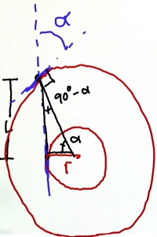
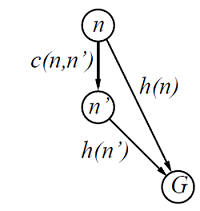

# Artificial Intelligence for Robotics

## Math

### Coordinates

#### Homogeneous Coordinate （齐次坐标）

- Derivation

  - Perspective Geometry

    - solving the limitation of euclidean geometry

      (actually euclidean geometry is a subset)

      $\Rightarrow$ describe parallel lines intersect at an infinite point in camera / human eyes

    - create a projective space \& establish transformation between euclidean space

- Definition

  - Point

    - $p'=(x',y')$ in Cartesian coord $\Rightarrow p=(x,y,w)$ in homogeneous coord,

      where $x' = \frac {x} w, y' = \frac {y} w$ 

    - $\Rightarrow (x,y, 0)$ for points at infinity, instead of tedious $(\infty,\infty)$ 

      $\Rightarrow$ $(0,0,1)$ for origin

    - homogeneous as for any normal point, $w$ takes any value except for $0$  

  - Vector

    - $v'=(a,b)$ in Cartesian coord $\Rightarrow v=(a,b,0)$ in homogeneous coord

- Describing Space

  - Line 

    - line $l'=ax'+by'+c = 0$ in Cartesian coord $\Rightarrow l=ax + by + cw = 0$ 

      (by replacing $x',y'$ with $x, y$)

    - $\Rightarrow$ parallel lines intersect at points at infinity

      $\begin{cases} ax + by + c_0 w = 0 \\ ax + by + c_1 w = 0 \end{cases}$ has solutions $(x,y,0)$, where $x,y\in \mathbb R$ 

  - Affine Transformation

    - definition: $y'=A'x'+b'$ in Cartesian space

    - translating into homogeneous space

      $\Rightarrow$ $x = [x'^T,1]^T, A=\begin{bmatrix} A', \mathbf 0 \\ \mathbf 0^T, 1 \end{bmatrix}$ where $\mathbf 0$ a col vector $[0,...,0]^T$ 

      $\Rightarrow$ hence $Ax \text{(homo)} \Leftrightarrow A'x' \text{(Cart)}$ 

      $\Rightarrow \text{construct} T = \begin{bmatrix} A', b \\ \mathbf 0^T, 1 \end{bmatrix}$ 
      
      $\Rightarrow y=Tx \text{(homo)}  \Leftrightarrow  y'=A'x'+b' \text{(cart)}$ 
      
    - $\Rightarrow$ single matrix for affine transformation 

- Understanding

  - Distinguishing Point vs. Vector

    - normal Cartesian point $p' = (x,y) \Rightarrow (x,y,1)$ 

    - normal Cartesian vector $v' = (x,y) \Rightarrow (x,y, 0)$, as an infinite point

      (as for vector, absolute position does NOT matter) 
    
  - Unifed Expression for Affine \& Linear Transformation
  
    - easier, simpler \& faster computation

## Topics

### Perception

#### Vision

#### Radar

### Localisation & Tracking

- Goal

  - Localisation 
    - tracking others location and motion
    - my localisation in local map
  - Time-series Prediction

- Approaches

  - Histogram Filters
    - discrete state - accuracy depends on resolution of grids
    - multi-modal
    - space complexity (in terms of dimensionfor localisation) - exponential
    - note: grids framework usually supported, boundary of grid may cause glicthes
  - Kalman Filters
    - continous state
    - uni-modal (single mode)
    - space complexity (in terms of dimensionfor localisation) - quadratic
    - has extension for multi-modal situation
  - Particle Filters
    - continuous state
    - multi-modal
    - space complexity (in terms of dimensionfor localisation) - exponential
    - note: easy to implement, can not regain the correct hypothesis once lost
  - Rao-Blackwellized Filters
    - particle filters + kalman filters
    - nail down some dimensions for particles $\Rightarrow$ everything else conditional on particles is Gaussian
    - $\Rightarrow$ exploit kalman filter attached to each particle

- Real-world Environement

  - Likelihood in Measurement: 

    - a coorelation function of
      1. how well the local map match the global map (e.g. google earth); 
      2. how approximation in producing local map and sensors characteristics are considered

  - Map Data

    - local map: based on SLAM (simultaneous localisation and mapping)
    - global map: GPS

  - Landmarks

    - static: prior map from global map & others to capture the static things
    - mobile: detected by motion vector from measurement of multiple time steps

  - Weather

    - rain: can be solved by adjusting constant parameters
    - snow cover: no easy solution - do NOT use & add more landmarks into system

  - Robot (car) Model

    - bicycle model: 2 steerable front wheels and 2 non-steerable back wheels

      $\Rightarrow$ some more pyhsics for steering & orientation

      1. $L$: length between front & back wheels, $\alpha$: steering angle, $r$: radius of back wheel in turning

         $\Rightarrow r = \frac L {\tan \alpha}$ 

            

#### Histogram Filters

- Notation

  - $X$: grid cell 
    - finest cell for location in 1D world
  - $Z$: measurement
    - robot observes the environment

- Measurement - M step

  - Prior

    - $P(X_i)$: probability of currently being in cell $i$ 

  - Likelihood

    - $P(Z|X_i)$: probability of having current measurement (observation) given being in cell $i$ 

      ​			(usually dominated by correctness of sensors)

  - Posterior

    - $P(X_i|Z)$: probability of being in cell $i$ after measurement (observation)

      $\begin{align} \displaystyle P(X_i|Z) &= \frac {P(X_i)P(Z|X_i)} {P(Z)} \\ &= \frac {P(X_i)P(Z|X_i)} {\sum_i P(X_i)P(Z|X_i)} \end{align}$

- Motion - E step

  - Performing Motion

    - $P(X_i | X_j)$: usually dominated by success probability of performing the motion

  - Updating after Motion

    - $P(X_i^t)$: Total probability of being in $i$ at time $t$ 

      $\displaystyle P(X_i^t) = \sum_j P(X_j^{t-1}) \cdot P(X_i | X_j)$ 

      $\Rightarrow$ a weighted sum over other probability

      $\Rightarrow$ convolution!

#### Kalman Filters from Linear Dynamic System

- Goal

  - Time-series Measurement
    - measure a quantity $z$ that is changing over time

    - latent variable ($z$) is continuous 

    - given observation $x_1, ...x_N$, find the correponding value $z_1, ...z_N$ 

      $\Rightarrow$ similar to hidden Markov model

  - Limited Complexity

    - efficient inference: distribution remains compatible $\Rightarrow$ exponential family (includes Gaussian)

      $\Rightarrow$ most practically, linear-Gaussian state space model

- Assumption

  - Linear-Gaussian State Space Model
    - both latent $(z)$ and observed $(x)$ variable are multi-variate Gaussian
    - probability over space discribed by a Gaussian bump
    - zero-mean Gaussian noise

- Measurement - M step

  - Posterior

    - prior: $P(x)\sim \mathcal N(\mu, \sigma^2)$ 
    - likelihood: $P(z|x) \sim \mathcal N (\upsilon, \gamma^2)$ 

    - $\Rightarrow$ posterior: $\displaystyle P(x|z) = \frac {P(x)P(z|x)} {\int_x P(x)P(z|x) dx}$ 

      $\Rightarrow$ $P(x|z) \sim \mathcal N (\mu',{\sigma '}^2)$, where 

      1. $\displaystyle \mu' = \frac {1} {\sigma^2+\gamma^2} [\gamma^2 \mu + \sigma^2 \upsilon]$ 
      2. $\displaystyle {\sigma'}^2 = \frac {\sigma^2\gamma^2} {\sigma^2 + \gamma^2}$ 

  - High Dimension Space - Multivariate Gaussian

    - update

      $\begin{align*} y&=z-Hx \\ S&= HPH^T+R & \text{map uncertainty into measurement space} \\ K &= PH^T S^{-1} \\ x' &= x+Ky \\ P' &= (I-KH)P \end{align*}$ 

    - where $Z\text{= measurement}, H\text{= measurement function}, R\text{= measurement noise}$ 

- Motion & Prediction - E step

  - Motion Update

    - probability of current location: $P(x^t) \sim \mathcal N (\mu, \sigma^2)$ 

    - motion uncertainty (statistical noise): $\mathcal N (0,\gamma^2)$ 

      ​	(assumed to be independent from location)

    - motion distance: $u$ 

    - $\Rightarrow$ probability of location at time $t+1$: $\displaystyle P(x^{t+1}) = \int_{x^t}  P(x^{t+1}|x^t)P(x^t) \space dx^t$ 

    - $\displaystyle P(x^{t+1}) \sim \mathcal N (\mu+u, \sigma^2+\gamma^2)$ 

  - Velocity

    - modeled as hidden variable

    - can be embedded into Prior,

      by stating the correlation between hidden states and observation (rotated multi-D Gaussian)

  - High Dimension Space - Multivariate Gaussian

    - $X' = FX+u \text{, where}$

      $\begin{align*} &X \text{= current location }, P\text{= uncertainty covariance}, \\ &F\text{= state transition matrix (where physics live)},u\text{= distance vector (a system input)}\end{align*}$  

#### Particle Filters

- Goal
  - for Not Linear-Gaussian
    - dynamical systems with no linear-Gaussian (e.g. non-Gaussian emmision density)
  - Tractable
    - based on sampling
- Particles
  - Instance of Robots
    - initialised randomly over the world
    - particles fit the actual measurement better have greater change to survive

  - Number

    - depends on total non-normalised importance weight

    - $\Rightarrow$ small - need more particles as tracking is poor; big - less as tracking is good

      (if in real-time system, cannot be dynamic then)

    - 
- Measurement
  - Prior
    - probability density of current location over the space of world
    - approximated by particles: instances of robot scattered in the world
  - Likelihood
    - becomes importance weight for each particle
  - $\Rightarrow$ Posterior
    - approximated by resampling: select instance with replacement according to their importance
- Motion
  - Prior
    - probability density of current location, approximated by particles
  - Transition Matrix
    - simulated by performing the motion with a noise, sampled from the noise distribution
  - Total Probability
    - calculate updated particles for all particles in the current set
    - represented & approximated by a new set of particles

### Planning

#### Path Planning

- Overview

  - Goal
    - choose the path to move from A to B
    - carry out the plan in a dynamic environment
  - Level
    - global routing - solved by google map
    - local path planning - solved by the robot, plan with in its sensor vision
  - Cost of Action
    - globally static - not considering the current feasibility of each action (as solved by google map)
    - locally look-ahead - update action cost based on current situation

- **A* Algorithm** 

  - Evaluation Function

    - $f(n) = g(n)+h(n), \text{ where }$ 
      1. $g(n) = \text{cost so far to reach } n$ 
      2. $h(n) = \text{estimated cost from } n \text{ to the goal}$ 
      3. $\Rightarrow f(n) = \text{estimated total cost of path through } n \text{ to the goal}$ 

  - Admissible Heuristic Function

    - $\forall n, h(n) \le h^*(n), \text{where } h^*(n) \text{ is the TRUE cost from n to goal}$ 

      (also, $h(n) \ge 0$ so that $h(G)=0$ for any goal $G$)	

    - $\Rightarrow f(n) \text{ never over-estimates the total cost of the shortest path through } n \text{ to goal}$ 0

    - derivation: can be from the optimal solution cost of a relaxed problem

      reason: optimal solution cost of a relaxed problem $\le$ optimal solution cost of the real problem

      example: ignoring robot's pysical constraints; ignore obstcles constraints;

  - Consistency in Heuristic Function

    - $\forall n,n', h(n) ≤ c(n, n′) + h(n′), \text{where } c(n,n') \text{ is the shortest path from }n \text{ to } n'$ 

        

    - $\Rightarrow$ if $h$ consistent, then $h$ is admissble, and $f(n)$ is non-decreasing along any path

      admissble: set $n'$ as goal node

      non-decreasing: 

      $\begin{align*} f(n') &= g(n') + h(n') \\ &= g(n) + c(n,n') + h(n') \\ &\ge g(n) + h(n) \\ &= f(n) \end{align*}$ 

      $\Rightarrow$ the expanded node always has a larger $f$ 

      $\Rightarrow$ $f$ value of the best (the $1^{st}$) node in frontier never decreases

      $\Rightarrow$ once a node is expanded, the cost by which it is reached is the lowest possible

  - Optimality based on Admissibility

    - theorm: if $h(n)$ admissible, A* algorithm finds the optimal solution

    - proof:

      suppose node $G_1,G_2$ are the goal nodes in respectively an optimal and sub-optimal path

      let $n$ be the node in the frontier

      $\begin{align*} \Rightarrow f(G_2) &= g(G_2) & G_2 \text{ is goal node} \\ &\ge g(G_1) & G_2 \text{ is subp-optimal} \\ & \ge f(n) & h(n) \text{ is admissble} \end{align*}$ 

      $\Rightarrow G_2$ will NOT be selected, even if it is generated in the frontier 

  - Implementation

    - frontier: a queue sorted in ascending value of $f(n)$ - expand node with the lowest $f$ value

  - Properties

    - complete: expands all $f(n) < C^*$ nodes; one $f(n)=C^*$ goal node; no $f(n)>C^*$ node
    - time complexity: exponential in $[\text{relative error in } h \times \text{ length of solution}]$ 
    - space complexity: exponential
    - optimal: if $h$ admissble

  - Multi-Goal

    - simply set multiple nodes as goal

- Dynamic Programming for Path Planing

  - Goal
    - best path to the goal location from every location $\Rightarrow$ a policy map (in a grid world)
    - concern: action may fail $\Rightarrow$ back-up plan for stochastic world & limited sensing ability

  - Cost Map

    - a look-up map for function: $\text{location }n \rightarrow f(n)$, where $f(n) = $ lowest cost from $n$ to goal

      $\Rightarrow f(n) = \min \{f(n') + c(n,n')|n' \text{ is direct neighbour of }n\}$,

      ​	where $c(n,n') =\text{cost from } n \text{ to } n'=\text{cost of action}$

    - $\Rightarrow$ can be solved for all localtions in BFS framework that

      1. starts from the goal location
      2. iterates through all directions (actions) at each node for possible updates

  - Cost Map with Stochastic Action

    - a look-up map for function: $(\text{location, action}) \rightarrow f(n)$, where $f(n)=$ lowest <u>expected</u> cost from $n$ to goal

      $\displaystyle \Rightarrow f(n) = \sum_{n'} P(n'|n,a)(f(n')+c(a)) = c(a) + \mathbb E_{n'|n,a} (f(n'))$, where

      ​	 $n'$ is direct neighbour of $n$; $a$ is action

    - $\Rightarrow$ can be solved in a BFS framework that

      1. starts from the goal location
      2. iterates through and evaluates all directions (actions) at each node
      3. accumulates the value from those evaluation to compute the expectation (the sum)

  - Policy Map

    - a look-up map for function: $\text{location} \rightarrow \text{action}$ 
    - $\Rightarrow$ solved iteratively / parallely after cost map obtained
    - $\Rightarrow$ choose the action that leads to the lowest $f(n')$ in the neighbour of $n$ 

  - Multi-Goal

    - simple set multiple nodes / grids as goal

- Pre-caching

  - Overview
    - pre-cache principle sub-plan $\Rightarrow$ path planning as a table look-up & provable to be optimal
    - example: Google map

#### Smooth Path Planning

- Goal
  - Robot Ability
    - infeasible for instantaneous turn

- Smoothing Algorithm

  - Notation

    - $x_0,...,x_N$: original discret nodes
    - $y_0,...,y_N$: discret nodes for the smooth path

  - Minimisation Goal

    - $\displaystyle J = \sum_{n=0}^{N}(x_n-y_n)^2 + \alpha (y_n-y_{n+1})^2, \text{where } \alpha \text{ is the smoothing weight} (\alpha \propto \text{ smoothness})$ 

      note: the start & goal node are not updated

    - $\Rightarrow$ $\displaystyle \frac {\partial} {\partial y_a} J = -2(x_a-y_a)+2\alpha(y_a-y_{a+1}) - 2\alpha(y_{a-1}-y_a), \text{where } a \in [1,N-1]$ 

    - $\Rightarrow$ gradient decent for update, with start & goal nodes excluded 

- Smoothing with Constraint

  - Fixed Point
  - ...

- Avoiding Collision

  - Concern
    - smooth path may run into obstacles avoided before
  - Approaches
    - use successive state vectors of robots for more information in path planning & smoothing
    - maximise distance between nearest obstacles and our nodes
    - use distance between obstacles as constraint
    - ...

### Control

- Concern
  - Timing
  - Robustness
  - Basins of Attraction

#### Steering Control

##### PID Control

- Goal
  - Steering
    - give path, evaluate the current bias & steer to the path
  - Stableness
    - stabilise the robot (vehicle) on the path
- Evaluating Current State
  - Cross Track Error (CTE)
    - the direct distance between robot and the tangent line of path
  - System Bias
    - error in measurement of steering angle (e.g. steering angle measured $0^\circ$, yet in fact $5^\circ$)
- P Controller
  - $\alpha = -\tau_P \cdot \text{CTE},$ 
    - where $\alpha$ is steering angle, $\tau_P$ is weight (steer in proportion to cross track error)
  - Result
    - robot's heading angle not aligned with the path when hitting it)
    - $\Rightarrow$ over-shoot & occillate along the path
- PD Controller
  - $\displaystyle \alpha = -\tau_P \cdot \text{CTE} - \tau_D \cdot \frac d {d_t}\text{CTE}, $ where 
    - $\tau_D$ is weight, $\displaystyle \frac d {dt} \text{CTE} = \frac {\text{CTE}_t - \text{CTE}_{t-1}} {\Delta t}$ 
  - Result
    - no more overshoot & occillation (previous steering considered)
    - system bias not tackled - will be eventually parallel to the desired path
- PID Control
  - $\displaystyle \alpha = \underbrace {-\tau_P\cdot \text{CTE}}_\text{Proportion} \space \underbrace {- \tau_D \cdot \frac d {d_t} \text{CTE}}_\text{Derivative} \space \underbrace{- \tau_I \sum_t \text{CTE}}_\text{Integral},$ where 
    - $\tau_I$ is  weight, $\displaystyle \sum_t \text{CTE}$ is integral of all CTE measured
  - Result
    - system bias noticed & corrected by integral term after a time span
    - yet, the extend of overshoot & ocillation $\propto$ $\tau_I$ 
- Coordinates Ascent for Optimising Weights
  - Goal
    - find the local optimum $\Rightarrow$ gradient decent for non-differentiable problem
  - Coordinates
    - the weights to be optimised ($\theta = [\tau_P,\tau_D,\tau_I]$) 
  - Steps
    - the steps increased/decreased for each axis ($d\theta=[d_P,d_D,d_I]$)
  - Iteration
    - for each axis, try increase/decrease the weight by its step
    - evaluate the cost under modified coordinates
      1. if better result, increase its step and move on to next axis;
      2. if worse result, decrease its step and retry, until the step is smaller then a threshold
    - iterate to a maximum iteration; or all steps are smaller then threshold
  - Comparable Optimisation Methods
    - swarm intelligence (e.g. PSO - particle swarm optimisation)

#### Speed Control

- Concern
  - Lateral Acceleration
    - back-propagate to the maximal speed allowed when starting the turning

  - Selection of Speed
    - based on requirement (e.g. guarantee to achieve a save stop)

#### Predictive Controller

- Concern
  - Timing
    - time lag between sense, decide and act $\Rightarrow$ no access to the <u>current</u> situation
- Approaches
  - Predicting Measurement
    - timing the processing of sensing, deciding & acting $\Rightarrow$ calculate / guarantee the delay
    - predict the measurement after the processing is finished

### Simultaneous Localisation And Mapping - SLAM 

- Goal
  - Mapping
    - accomodating the lack of prior map $\Rightarrow$ building the map
  - Localisation
    - uncertainty in robot motion $\Rightarrow$ need to address localisation
    - localising with self-built map

#### Graph SLAM

- Constraint

  - Local Constraint Types

    - initial location: prior belief of starting location (usually origin)

    - relative motion constraint: motion uncertainty 

      $\Rightarrow$ Gaussian distribution of expected (predicted) location

      ​	note: may model different axises independently $\Rightarrow$ a product (bayesian rule)

    - relative measurement constraint: measurement uncertainty

      $\Rightarrow$ Gaussian distribution of measured landmark

  - Direct Constraint Matrix (representing a factor graph)

    - observation as indices
      1. sequence of robot poses (location) $[x_0,x_1,...,x_N]$ 
      2. sequence of measurement of landmarks $[L_0,L_1,...,L_M]$ 
    - constraint matrix $\Omega$ 
      1. initialised by $0$ 
      2. accumulate the coefficient of the constraint equation (expected transition for the state)
    - constraint vector $\xi$  
      1. initialised by $0$ 
      2. accumulate the value of constraint equation
    - update rules
      1. 

- Maximum Likelihood

- Estimation under Constraint

  - Best Estimatation $\mu$ 
    - $\mu = \Omega^{-1}\cdot \xi$ 

- Online SLAM

  - Problem

    - size of $\Omega$ grows in $\mathcal O (n)$ in terms of robot's trajectory

  - Adding 

    - insert corresponding row & column in $\Omega$ and $\xi$ 
    - $\Rightarrow \Omega$ coordinates = $[x_t,x_{t+1}, L_0,...,L_M]$ 

  - Discarding

    - $\Omega = \Omega' - A^TB^{-1}A$, where $A=\Omega[x_t,x_t:]$, $B=\Omega[x_t,x_t]$, $\Omega'=\Omega[x_{t+1}:,x_{t+1}:]$ 

    - $\xi = \xi'-A^TB^{-1}C$, where $C=\xi[x_t]$, $\xi'=\xi[x_{t+1}:]$ 

      note: cooresponding to integrating the Gaussian of history poses

- Real World Situation

  - Landmark Constraint
    - landmark: local image
    - $\Rightarrow$ constraint: how the boundary & center should fit, etc.
  - Dynamic Landmarks
    - (cumbersome) tracking landmarks with time-stamp (similar to robot poses)
    - $\Rightarrow$ new set of constraints $\Rightarrow$ margnalise over the old measurement as in online SLAM

- SLAM Research

  - University of Washinton
    - Steve Seitz: large image collection 3D reconstruction map

## Application

### Autonomous Driving

- Scenario
  - Highway
    - transportation
    - personal vehicle
  - Semi-enclosed Area
    - minibus in airport, port, etc.
    - valet parking
    - auto-worker
  - Restricted Road Condition
- Open-source Platform
  - Apollo
    - cloud: HD map, GPS, auto-update, internet of vehicle, over-the-air update, ...
    - software: pilot algorithm, user interaction
    - hardware: compute utility and other control units 
    - vehicle: 
- Real-time Requirement
  - Preference
    - normal > collision avoidance > light collision > severe collision
  - Defined Boundary
    - 
  - Safety Monitoring & Recording
    - driver condition
    - environment, road condition
  - Hardware Survival Capability
    - temperature, humidity, voltage, impact, EMC, etc.
    - field test: GMW3172
  - Redundancy
    - performance: 
    - information:
    - timing:
  - Degradation
    - driver intervention alert based on monitoring
  - Fail Safe
    - stop in safe zone 
- System Evaluation Metric
  - Safety
    - mile per intervention (MPI)
    - autonomous driving system coverage (ADSC)
  - Experience
    - mile per bad experience (MPBE)
  - Meta-Metric
    - total miles driven (TMD) $\Rightarrow$ the larger, the more accurate other metrics can be
- Business Expectation
  - Platform
    - as operating system, provide extra-value service
  - Robo-Taxi